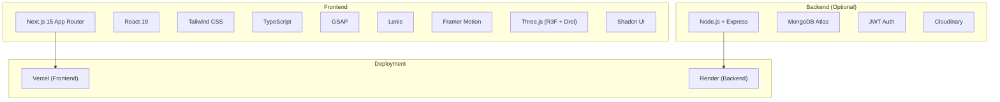
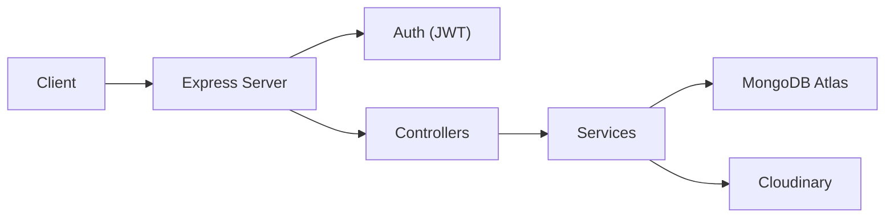
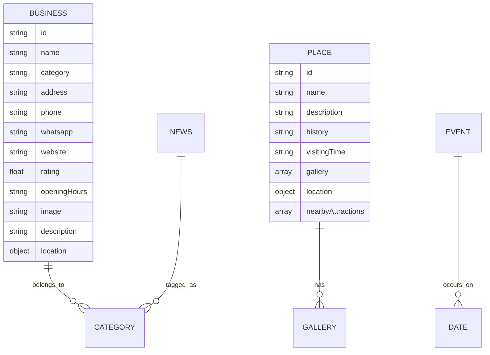

## 1. Architecture Design



## 2. Technology Description
- Frontend: Next.js 15 (App Router) + React 19 + TypeScript + Tailwind CSS + Shadcn UI
- Animations: GSAP, Framer Motion, Lenis (smooth scroll), Three.js (React Three Fiber + Drei)
- Initialization Tool: create-next-app@latest
- Backend (future): Node.js + Express + MongoDB Atlas + JWT + Cloudinary
- Deployment: Vercel (frontend), Render (backend)

## 3. Route Definitions
| Route | Purpose |
|-------|---------|
| / | Home page with hero, navigation, storytelling |
| /about | About Dohrighat, history, culture, timeline |
| /explore | Explore interactive cards for key locations |
| /places | Famous places with modals and maps |
| /food | Food and markets showcase |
| /business | Business directory with search/filters |
| /gallery | Photo gallery (masonry, lightbox) |
| /events | Events and festivals timeline |
| /news | News portal |
| /contact | Contact page |
| /emergency | Emergency services |

## 4. API Definitions (future)
```typescript
// Business type
interface Business {
  id: string;
  name: string;
  category: string;
  address: string;
  phone?: string;
  whatsapp?: string;
  website?: string;
  rating?: number;
  openingHours?: string;
  image?: string;
  description?: string;
  location: { lat: number; lng: number };
}

// Place type
interface Place {
  id: string;
  name: string;
  description: string;
  history?: string;
  visitingTime?: string;
  gallery: string[];
  location: { lat: number; lng: number };
  nearbyAttractions?: string[];
}

// Event type
interface Event {
  id: string;
  name: string;
  date: string;
  description: string;
  image: string;
}
```

## 5. Server Architecture Diagram (future)


## 6. Data Model (future)
### 6.1 Data Model Definition

