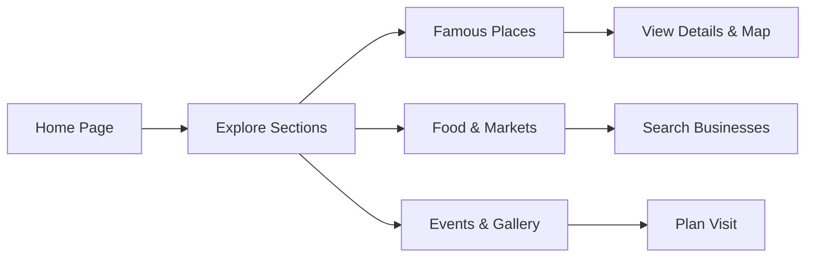

## 1. Product Overview
An ultra-premium, cinematic digital experience for Dohrighat, Uttar Pradesh, celebrating its riverfront, heritage, culture, and local businesses with luxury design and immersive storytelling.
- Primary audience: Tourists, locals, business owners, and investors seeking information about Dohrighat
- Market value: Elevates Dohrighat's digital presence to international luxury tourism standards, driving economic and cultural growth

## 2. Core Features

### 2.1 User Roles
| Role | Registration Method | Core Permissions |
|------|---------------------|------------------|
| Normal Visitor | None | Full access to all public content, explore, plan visit, use AI features |
| Admin (future) | JWT Authentication | Manage content, businesses, news, events |

### 2.2 Feature Module
1. **Home page**: Hero section with cinematic video, animated particles, navigation, immersive storytelling
2. **About Dohrighat**: History, culture, importance, animated timeline
3. **Explore Dohrighat**: Interactive cards for river, ghats, temples, markets, nature
4. **Famous Places**: Cinematic cards with modals, galleries, maps, travel guides
5. **Food & Markets**: Premium food showcase, business directory with search/filters
6. **Gallery**: Pinterest-style masonry gallery with lightbox, categories
7. **Events & Festivals**: Immersive event timeline
8. **News & Weather**: News portal, live weather updates
9. **Emergency & Services**: Quick access emergency cards
10. **AI Features**: AI tourist guide, voice search, chat assistant, translation

### 2.3 Page Details
| Page Name | Module Name | Feature description |
|-----------|-------------|---------------------|
| Home | Hero | 100vh cinematic drone video, animated particles, floating glass cards, luxury typography, CTA buttons, mouse parallax |
| Home | Navigation | Floating glass navbar, sticky scroll, animated underline, premium hover effects |
| About Dohrighat | Storytelling | Animated timeline, sections on history, culture, river, trade, future vision |
| Explore | Interactive Cards | Expand-on-hover cards with animated image transitions |
| Famous Places | Cinematic Cards | Large cards with modal galleries, Google Maps integration |
| Business Directory | Search & Filters | Animated filters, categories, premium business cards |
| Gallery | Masonry Layout | Infinite scroll, hover zoom, fullscreen viewer, lazy loading |

## 3. Core Process
Visitor lands on home page → explores hero section → navigates to desired sections (about, explore, places, food) → uses interactive features (search, filters, maps) → plans visit via AI guide and emergency info

## 4. User Interface Design

### 4.1 Design Style
- Primary colors: Ultra dark (#050505), Royal Gold, Emerald, Blue Glow, Silver
- Typography: Large cinematic serif headlines, elegant sans-serif body, huge spacing
- Buttons: Magnetic, glassmorphism, animated gradient borders
- Layout: Immersive full-screen sections, parallax, pinned sections, glass cards
- Effects: Aurora backgrounds, animated mesh gradients, particle systems, liquid motion, lens flare, water ripples

### 4.2 Page Design Overview
| Page Name | Module Name | UI Elements |
|-----------|-------------|-------------|
| Home | Hero | Cinematic video background, dark overlay, animated particles, floating fog, light rays, luxury serif typography, mouse parallax, CTA buttons |
| About | Timeline | Animated timeline with scroll reveal, glass cards, gradient accents |
| Explore | Cards | Expand-on-hover interactive cards, smooth image transitions, depth effects |
| Gallery | Masonry | Pinterest-style layout, hover zoom, lazy loading, blur-up effect, fullscreen lightbox |
| Footer | Premium Footer | Black glass footer, animated river wave, newsletter, social links, quick links |

### 4.3 Responsiveness
Desktop-first, fully responsive on all screen sizes (laptop, tablet, mobile), touch optimized, smooth scrolling via Lenis

### 4.4 3D Scene Guidance
- Environment: Dark cinematic, volumetric fog, aurora background
- Lighting: Ambient + directional with soft shadows
- Camera: Parallax on mouse move, smooth scroll transitions
- Elements: Animated particles, floating icons, river water effects
- Post-processing: Bloom, soft glow, vignette
